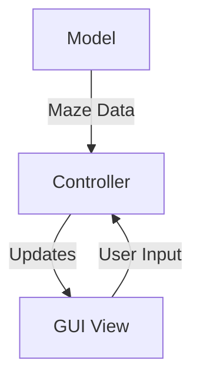

# **Dungeon Maze: Graphical Adventure Game**
*A Java-based asynchronous dungeon crawler with GUI, monsters, and treasure mechanics*


---

## **Table of Contents**
1. [Overview](#overview)
2. [Key Features](#key-features)
3. [Game Architecture](#game-architecture)
4. [How to Run](#how-to-run)
5. [Game Controls](#game-controls)
6. [Screenshots](#screenshots)
7. [Technical Specifications](#technical-specifications)
8. [Assumptions](#assumptions)
9. [Citations](#citations)

---

## **Overview**
This graphical adventure game extends a maze navigation system with:
- **Procedurally generated** wrapping/non-wrapping dungeons
- **Combat system** against stationary (Otyugh) and moving (Berbalang) monsters
- **Treasure mechanics** with thieves, pits, and collectibles (Diamonds/Rubies/Sapphires)
- **Dual-view GUI**:
  - *Bird's-eye view* (fog-of-war exploration)
  - *First-person view* (location-specific details)

Built with **100+ test cases** covering edge cases, input validation, and game logic.

---

## **Key Features**

### **Dungeon Generation**
- Configurable grid size (rows × columns)
- Wrapping/non-wrapping topology
- Custom interconnectivity levels
- Start/end caves ≥5 nodes apart

### **Gameplay Mechanics**
| Feature | Description |
|---------|-------------|
| **Monsters** | Otyugh (stationary), Berbalang (mobile) |
| **Combat** | Arrows (50 damage), Hand-to-hand (randomized) |
| **Hazards** | Pits (detectable by wind), Thieves (steal treasure) |
| **Collectibles** | Diamonds (2000 pts), Rubies (1000 pts), Sapphires (500 pts) |
| **Navigation** | Bidirectional paths, Wrapping movement |

### **GUI System**
- **Real-time rendering** of visited locations
- **Dynamic first-person view** showing:
  - Local treasures/arrows
  - Monsters/pits/thieves
- **Visual cues** for smells (monster proximity), wind (pit nearby)

---

## **Game Architecture**


1. **Model**: Handles maze generation, game state, and rules
2. **Controller**: Manages input/output and model-view synchronization
3. **View**: Dual-panel Swing GUI with asynchronous updates

---

## **How to Run**
### Requirements:
- Java Runtime Environment (JRE) 8+
- [Download JAR](path/to/your.jar)

### Command Line:
```bash
java -jar DungeonMaze.jar [--wrapping] [--rows 10] [--cols 15] [--interconnectivity 2]
```

---

## **Game Controls**

### **Movement & Actions**
| Key | Action |
|-----|--------|
| **↑↓←→** | Move player |
| **A/S/D/R** | Pick Arrow/Sapphire/Diamond/Ruby |
| **C + Direction + Number** | Shoot arrow (e.g., `C ↑ 2`) |
| **P** | Punch (melee combat) |
| **J + Direction** | Jump over pits |
| **Mouse Click** | Select path openings |

### **UI Buttons**
- Restart/Reset/Exit (via JMenu)
- Inventory display

---

## **Screenshots**
[View Full Gallery](https://drive.google.com/drive/folders/1sACwgV-bSZJznlF54CpduCG4OHva_VhZ)

| Feature | Preview |
|---------|---------|
| **Settings Menu** |  |
| **Combat (Win/Lose)** |  |
| **Pit Detection** |  |

---

## **Technical Specifications**
- **Language**: Java 11
- **Libraries**: Swing (GUI), JUnit (Testing)
- **Design Patterns**: MVC, Observer, Factory
- **Algorithms**: BFS (pathfinding), Randomized Prim's (maze gen)

---

## **Assumptions**
1. Minimum 10 locations per dungeon
2. Treasures don't respawn
3. Arrows are permanently consumed when used
4. Berbalang is immune to arrows (dodging)

---

## **Citations**
1. Oracle Java Docs: [Generics](https://docs.oracle.com/javase/tutorial/java/generics/subtyping.html)
2. Javatpoint: [BFS Algorithm](https://www.javatpoint.com/bfs-algorithm-in-java)
3. TutorialHorizon: [Graph Implementation](https://algorithms.tutorialhorizon.com/graph-implementation-adjacency-list-better-set-2/)

---

**Note**: For bug reports or contributions, please open an issue on [GitHub](your_repo_link).
